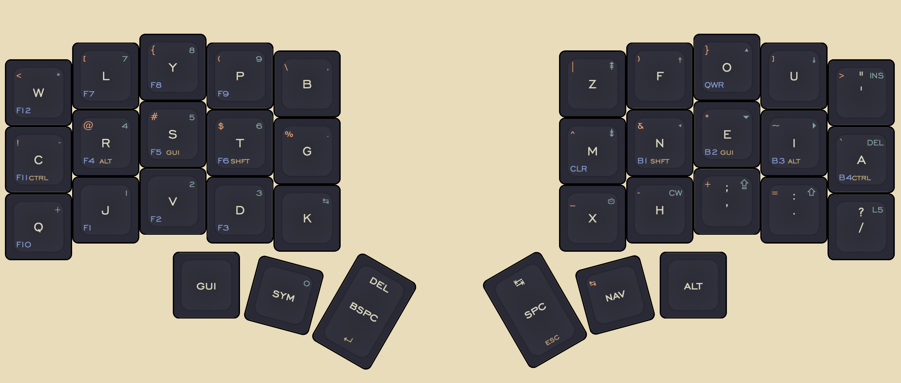
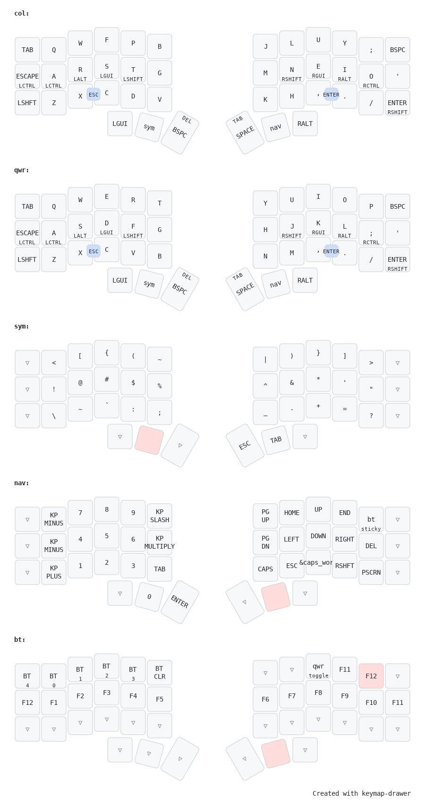

# Layouts

<span style="color:red">OUTDATED</span>.


* coming soon: 

## Extended Layouts
[extended zen](./zen-layout.png)
[extended chiff](./chiff-layout.png)
[extended cornetto](./cornetto-layout.png)

# Versions
Every version before is "archival" and considered sub v1 I guess...

A brief history:

My introduction to layers was from the Anne Pro 2 with "magic caps". To put it shortly, it was the start of a glorious relationship. I loved having arrow keys right under my fingertips. When I got my iris, I put the "removed" symbols all on one layer with some navigation keys, and it stayed pretty unevolved like that for quite a while. 

The next evolution was a kind of renaissance for my interest in new keyboards (I had a rule for myself forbidding duplicate keyboards essentially). I love the MDA keycap profile, and an inoffensive keycap set came out that I bought the blanks for (MDA future suzuri). I thought "I touch type. Why the hell not?" The only issue was accuracy in stretching up to R1 for the numbers without the visual aid of number legends. So I tried moving numbers right under the home row, split my layers into navigation/function and number/symbol layers, and I actually ended up really liking it. In the end this was pretty much the last "hold out" until 40% keyboards were a viable option for me. And that brings us to the first 40% compatible key layouts.


Here are the "characterizing" features of each version:
1. Base qwerty layer, numrow/symbol layer + nav layer, and braces on combos
    - This version was born out of my desire to use a 5 col keyboard. It never *really* worked because io/ui rolls couldn't be worked out with timing, even with 30ms. I would also misfire esc on er on the left hand. But I wouldn't know until I tried.
2. Numpad + removal of bracket combos
    - This one involved a huge rework of my layers to fit all brackets onto their own row in the symbol layer, and moving the symbol layer down because of constant misfires (would hit numbers instead of symbols). I was intending to swap the num/shifted symbol rows, but was able to shuffle things to fit and try out a numpad
3. Addition of Colemak-DH layer
    - While massively messing up my muscle memory, I figured I would throw an alternate key layout in the mix *officially*.
4. Colemak-DH is base layer
    - I realized that without colemak on base layer, I would have to toggle back to that layer after waking my wireless keyboard every time... annoying.
5. Backspace is on left thumb. Centered around re-prioritizing 6 key functions: space, backspace, enter, esc, del, tab
    - I started thinking about backspace on base layer after a meetup, and tried it. This made more sense, as I would be backspacing more than hitting esc. The very same weekend I added key overrides to move delete off of my pinky. The thought process is that delete is kind of a modified backspace, and tab is also a sort of modified space, hence shift + space/backspace.
    - Unfortunately, my timing on releasing shift after letters like "I" leaves something to be desired. I will have to work on this or come up with an alternative.
    - Additionally, (not quite sure which version this happened in) I removed the parentheses from their spots on the symbol row that comes from numbers for "symmetry" with the other brackets/braces. I have some duplicated symbols while I nail down the best spots for things, and I may move the :; in favor of ~` on sym row (they're on base row so this isn't as important of a refinement).

6. While looking for an example of an svg style config for keymap-drawer, urob's kle map helped me realize that I could condense some of my duplicate and unused symbols. Namely, the angle brackets on the comma and period keys. This also means there is space on the base layer for '", and space on the home row layer for ~\` (like I had originally planned to do with ~\`). This should be more comfortable in the long run, as I believe that quick access to double/single quote is essential for the standard english typing flow. I used to think pretty firmly that my smaller keymaps should be as close to a proper subset of my larger maps as strictly possible for simplicity and easy switching. Now that I have branched out, I realize that majority of the time I will be using my own keyboards anyway, and it isn't that difficult to switch after learning colemak-dh. This version kind of abandons the perfect/proper subset rule with its overrides and base layer differences.
    - ' back on base layer of 5 col boards
    - uses more overrides to get ;: back on base layer (with the help of shift)
    - ~` off of bottom left row for symbols, which is the weakest side and row, and made for slow typing


7. Switching to canary

8. Switching to fletchling
    8.5 Swapping the number symbols row with the braces row, because parens and braces are used more than those few symbols, apart from maybe vim

9. Prioritizing shift over esc
    - I don't mind the two key action to use esc on the symbol layer instead of dedicated, but I do use enter enough that I notice it more. Second thumb key is now one shot shift on tap and caps word on double tap


#### TROUBLESHOOTING
When flashing on Linux, make sure to mount the keyboard before copying the UF2.

- To pair:
```zsh
bluetoothctl
scan on # then wait for the name to pop up, and take note of the MAC address
pair <MAC address>
connect <MAC address>
trust <MAC address>
```

Sometimes, when using settings reset firmware (after changing the name of the board for example), the keyboard is remembered by your device, and device forgotten by board. Just restart bluetooth service, and it should be solved.

```zsh
systemctl restart bluetooth # does this need sudo?
```

#### WIP Keymap Drawer Config
gruvbox
```css
svg.keymap { fill: #f3deaa; }

            rect.key { fill: #3c3836; }
            rect.key, rect.combo { stroke: #3c3836; }
            rect.combo, rect.combo-separate { fill: #af3a03; }
            rect.held, rect.combo.held { fill: #ae5858; }
            text.label, text.footer { stroke: black; }
            text.trans { fill: #7e8184; }
            path.combo { stroke: #7f7f7f; }
```
kanagawa
```css
svg.keymap { fill: #f3deaa; }
            rect.key { fill: #2A2A37; }
            rect.key, rect.combo { stroke: #2A2A37; }
            rect.combo, rect.combo-separate { fill: #907CB4; }
            rect.held, rect.combo.held { fill: #79A39D; }
            text.label, text.footer { stroke: black; }
text.hold {stroke:  #C0A26E;}
            text.trans { fill: #7e8184; }
            path.combo { stroke: #7f7f7f; }
```

## Alternate key layouts
About a year ago, I decided I wanted to try a layout more comfortable than QWERTY. I then put that on pause so that I wouldn't look like a fool on scree share at my first job. (That was a mistake.)

Anywho. Fast forward to May 2025, and the itch is emerging again. I dove into colemak-dh (I figured since most find it more comfy than vanilla, I should go ahead). Giving up vanilla colemak meant losing muscle memory for paste, which was a trade I was willing to make. As I rose to a comfortable typing speed, I had a growing resentment for a few things: the lk bigram (right index), A being all by its lonesome on the left hand, (and niche things like the location of jk and zq bigram for vim). I didn't like how often I was pressing those corner keys, v and k. I loved a few things, least obvious being the location of L, and things like cd bigram. 

So, what to do? Since I already have learned an akl, and already abandonded the shortcut muscle memory, there is nothing to lose by giving up those few things and learning a different akl.

In searching for a remedy, I considered gallium, graphite, nerps, aptv3 (particularly tempting for its jk placement), and canary. Key points were base layer punctuation (did not want to shake up my symbol layer too severely), which actually ruled out a lot... and some other things I am forgetting at the moment. 

First thoughts - I dislike the HO bigram, the new position of L and W (W more so), and the sfb UI.

I did like the rolls colemak dh provided as well.

I should consider swapping space and backspace. To balance out the right hand dominance.
